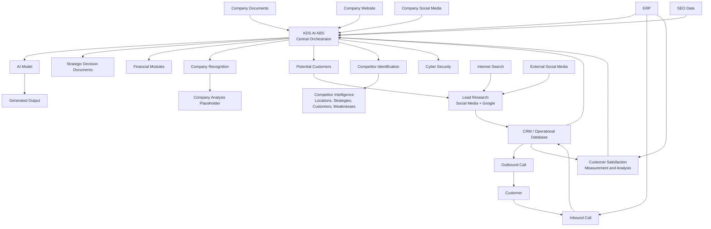

# Agentic Growth Intelligence System — Architecture Context for Codex

## 1. Purpose

This document translates the supplied system diagram into a Codex-readable software architecture specification.

The system is intended to:

- ingest internal company data,
- understand the company and its market,
- identify and research potential customers,
- analyze competitors,
- support financial and cyber-security related analysis,
- integrate CRM, ERP, inbound call, and outbound call workflows,
- generate strategic decision documents,
- use an AI model to produce actionable outputs.

This file should be treated as the initial architecture context. Some boxes in the source diagram are conceptual and require later clarification.

---

## 2. High-Level System Definition

**System name:** Agentic Growth Intelligence System

**Core orchestrator:** `KDS AI ABS`

`KDS AI ABS` is the central decision-support and agent orchestration layer. It receives company data, coordinates analysis workflows, produces strategic decision documents, and passes relevant context to the AI model.

The system has five principal domains:

1. Internal company intelligence
2. Customer and lead intelligence
3. Competitor intelligence
4. Operational CRM / ERP / call workflows
5. Strategic AI decision generation

---

## 3. Source Diagram Interpretation

### 3.1 Internal Data Sources

The following sources feed the central system:

- Company documents
- Company website
- Social media accounts
- ERP
- CRM

These sources provide the organizational context required by `KDS AI ABS`.

### 3.2 Central Intelligence Layer

`KDS AI ABS`:

- receives internal company data,
- triggers specialized analysis modules,
- produces strategic decision documents,
- sends contextualized information to an AI model,
- may receive operational information from ERP and other business systems.

### 3.3 AI Model and Output

Flow:

```text
KDS AI ABS -> Model -> Output
```

The `Model` consumes structured context prepared by `KDS AI ABS`.

The `Output` component represents model-generated results such as:

- recommendations,
- action plans,
- summaries,
- reports,
- strategic proposals,
- workflow instructions,
- sales or marketing actions.

### 3.4 Analysis Modules

The diagram contains these main analysis branches:

- Financial Modules
- Company Recognition
- Potential Customers
- Competitor Identification
- Cyber Security

#### Company Recognition

The first stage is labeled `1. Şirketi Tanı`.

Its purpose is to build an internal company profile from internal data sources.

The unlabeled orange node below it is interpreted as a later company-analysis stage. Its exact responsibility is not defined in the diagram and should remain an explicit placeholder.

#### Potential Customer Workflow

```text
Potential Customers
    -> Research customers via Social Media and Google
    -> Database / CRM
    -> Outbound Call
```

The results of lead research are stored in CRM or another database before outbound engagement.

#### Competitor Workflow

```text
Who are the competitors?
    -> Competitor locations
    -> Competitor strategies
    -> Competitor customers
    -> Competitor weaknesses
```

#### Cyber Security

The `Cyber Security` branch is directly orchestrated by `KDS AI ABS`, but the source diagram does not define its internal sub-workflows.

#### Financial Modules

`Financial Modules` is a separate specialized subsystem connected to the central orchestration flow.

### 3.5 ERP, CRM, and Call Workflows

The diagram includes:

- ERP
- Database / CRM
- Inbound Call
- Outbound Call
- Customer Satisfaction Measurement and Analysis

Observed relationships:

```text
Database / CRM -> Outbound Call
ERP -> Inbound Call
Inbound Call -> Database / CRM
ERP -> Customer Satisfaction Measurement and Analysis
ERP -> KDS AI ABS
```

The inbound call system appears to both consume ERP context and write/update customer information in CRM.

### 3.6 External Research Space

The diagram also shows unconnected or loosely connected external domains:

- Internet
- SEO
- Social Media
- Customer

These are interpreted as external research and interaction environments.

They should become explicit adapters or data sources in implementation:

- Internet search adapter
- SEO analytics adapter
- Social media adapter
- Customer interaction channel

---

## 4. Recommended Architecture



---

## 5. Component Specifications

### 5.1 `kds_ai_abs`

**Role:** Central orchestration, decision support, context assembly, and agent coordination.

**Responsibilities:**

- receive events and data from all source adapters,
- normalize data,
- decide which agent or workflow should run,
- assemble model context,
- trigger AI inference,
- persist decisions and reports,
- trigger operational actions,
- maintain audit logs,
- prevent unauthorized autonomous actions.

**Suggested interface:**

```python
class KDSAIABS:
    async def ingest(self, source: str, payload: dict) -> str:
        ...

    async def run_workflow(
        self,
        workflow_name: str,
        context: dict
    ) -> dict:
        ...

    async def generate_strategic_document(
        self,
        objective: str,
        context: dict
    ) -> dict:
        ...

    async def propose_actions(self, context: dict) -> list[dict]:
        ...
```

### 5.2 `company_intelligence`

**Purpose:** Build and maintain a company profile.

**Inputs:**

- documents,
- website content,
- social media content,
- ERP data,
- CRM data.

**Outputs:**

- company summary,
- products and services,
- target sectors,
- customer segments,
- strengths,
- weaknesses,
- business constraints,
- active goals,
- current operations.

### 5.3 `lead_intelligence`

**Purpose:** Discover, research, score, and store potential customers.

**Workflow:**

1. Define ideal customer profile.
2. Search the internet, Google-like search providers, and social media.
3. Extract candidate companies or individuals.
4. Enrich candidates.
5. Score candidates.
6. Store approved leads in CRM.
7. Trigger outbound call workflow only after policy checks.

**Lead entity:**

```yaml
Lead:
  id: string
  name: string
  company_name: string | null
  source: string
  website: string | null
  social_profiles: [string]
  location: string | null
  industry: string | null
  contact_information:
    email: string | null
    phone: string | null
  score: float
  score_reasons: [string]
  status: discovered | enriched | qualified | rejected | contacted | converted
  created_at: datetime
  updated_at: datetime
```

### 5.4 `competitor_intelligence`

**Purpose:** Identify competitors and build structured competitor profiles.

**Competitor profile fields:**

```yaml
Competitor:
  id: string
  name: string
  website: string | null
  locations: [string]
  products: [string]
  strategies: [string]
  customer_segments: [string]
  strengths: [string]
  weaknesses: [string]
  seo_signals: object
  social_signals: object
  evidence: [Evidence]
  last_analyzed_at: datetime
```

### 5.5 `financial_modules`

**Purpose:** Analyze financial and commercial information.

The source diagram does not define exact financial capabilities.

Initial implementation may include:

- revenue trend analysis,
- expense analysis,
- customer profitability,
- campaign ROI,
- cash-flow indicators,
- anomaly detection,
- basic forecasting.

No financial action should be executed autonomously in the MVP.

### 5.6 `cyber_security`

**Purpose:** Provide security-related analysis to the decision-support layer.

Initial implementation may include:

- public attack-surface inventory,
- security posture checklist,
- exposed credential alerts from authorized providers,
- vulnerability report summarization,
- security policy analysis.

The subsystem must not perform offensive actions.

### 5.7 `crm_adapter`

**Purpose:** Read and write customer and lead records.

**Required operations:**

```text
create_lead
update_lead
get_lead
search_leads
create_activity
record_call_result
update_customer_status
get_customer_history
```

### 5.8 `erp_adapter`

**Purpose:** Read business and operational information from ERP.

**Possible data:**

- customer records,
- orders,
- invoices,
- products,
- stock,
- service requests,
- financial summaries,
- customer activity.

ERP writes should be disabled in the MVP unless explicitly approved.

### 5.9 `inbound_call_workflow`

**Purpose:** Handle incoming customer calls.

**Flow:**

1. Identify caller.
2. Retrieve ERP and CRM context.
3. Generate agent-assist response.
4. Record call summary.
5. Update CRM.
6. Detect satisfaction or escalation signals.
7. Send structured result to central orchestrator.

### 5.10 `outbound_call_workflow`

**Purpose:** Contact approved leads or customers.

**Flow:**

1. Receive qualified CRM record.
2. Check consent, suppression, and policy rules.
3. Generate call brief.
4. Place or assist the call.
5. Record result.
6. Update CRM.
7. Schedule follow-up where approved.

### 5.11 `customer_satisfaction`

**Purpose:** Measure and analyze customer satisfaction.

**Inputs:**

- ERP interactions,
- CRM activity,
- inbound calls,
- outbound calls,
- surveys,
- complaints,
- service history.

**Outputs:**

- satisfaction score,
- churn risk,
- issue categories,
- recommended follow-up,
- aggregate trends.

### 5.12 `strategic_document_generator`

**Purpose:** Produce decision-ready business documents.

**Example document types:**

- company intelligence report,
- market opportunity report,
- competitor analysis,
- lead generation plan,
- customer satisfaction report,
- growth strategy,
- campaign recommendation,
- executive summary.

Every generated document must include evidence references.

---

## 6. Shared Data Contracts

### 6.1 Evidence

```yaml
Evidence:
  id: string
  source_type: document | website | social_media | erp | crm | search | seo | call
  source_uri: string | null
  source_record_id: string | null
  title: string | null
  excerpt: string | null
  collected_at: datetime
  confidence: float
  metadata: object
```

### 6.2 Strategic Decision

```yaml
StrategicDecision:
  id: string
  title: string
  objective: string
  summary: string
  findings: [string]
  recommendations: [Recommendation]
  risks: [string]
  evidence_ids: [string]
  status: draft | awaiting_approval | approved | rejected | executed
  created_at: datetime
```

### 6.3 Recommendation

```yaml
Recommendation:
  id: string
  description: string
  rationale: string
  expected_impact: low | medium | high
  effort: low | medium | high
  confidence: float
  required_approval: boolean
  proposed_action_type: string
```

### 6.4 Workflow Run

```yaml
WorkflowRun:
  id: string
  workflow_name: string
  trigger_type: manual | scheduled | event
  input: object
  output: object | null
  status: pending | running | completed | failed | cancelled
  started_at: datetime | null
  finished_at: datetime | null
  error: string | null
```

---

## 7. Recommended Repository Structure

```text
agentic-growth-intelligence/
├── README.md
├── docs/
│   ├── architecture.md
│   ├── workflows.md
│   ├── data-model.md
│   └── assumptions.md
├── apps/
│   ├── api/
│   ├── worker/
│   └── dashboard/
├── packages/
│   ├── orchestrator/
│   ├── agents/
│   │   ├── company_intelligence/
│   │   ├── lead_intelligence/
│   │   ├── competitor_intelligence/
│   │   ├── financial_analysis/
│   │   ├── cyber_security/
│   │   └── strategic_writer/
│   ├── integrations/
│   │   ├── crm/
│   │   ├── erp/
│   │   ├── web_search/
│   │   ├── seo/
│   │   ├── social_media/
│   │   └── telephony/
│   ├── knowledge/
│   ├── database/
│   ├── models/
│   ├── policies/
│   └── observability/
├── tests/
│   ├── unit/
│   ├── integration/
│   └── workflows/
└── infra/
    ├── docker/
    └── migrations/
```

---

## 8. Suggested MVP Scope

The MVP should not implement every box in the diagram.

Recommended MVP:

1. Company document ingestion
2. Website ingestion
3. Company profile generation
4. Potential customer research
5. CRM-compatible lead storage
6. Competitor profile generation
7. Strategic report generation
8. Human approval before any outbound action
9. Basic workflow logs and evidence tracking

Defer to later phases:

- automated inbound calling,
- automated outbound calling,
- full ERP integration,
- autonomous financial actions,
- broad cyber-security automation,
- direct social media actions.

---

## 9. System Rules for Codex

When generating code for this project, follow these rules:

1. Do not hard-code a specific CRM, ERP, telephony, search, or LLM provider.
2. Use adapter interfaces for all external services.
3. Keep read operations separate from write/action operations.
4. Require explicit human approval for:
   - outbound calls,
   - customer messaging,
   - CRM status changes with business impact,
   - financial actions,
   - external publication,
   - security actions.
5. Every report and recommendation must reference evidence.
6. Every workflow run must be logged.
7. Make workflows idempotent where possible.
8. Store secrets only in environment variables or a secret manager.
9. Validate all model outputs with typed schemas.
10. Never treat generated model text as trusted executable input.
11. Add retry, timeout, and rate-limit handling to external integrations.
12. Preserve tenant separation if multiple companies will use the platform.
13. Prefer event-driven workflows for CRM, ERP, and call updates.
14. The initial implementation should support local development with mock adapters.
15. Add tests for orchestration logic before implementing real integrations.

---

## 10. Open Questions and Ambiguities

The following items are not fully defined in the source diagram:

1. What does `KDS AI ABS` expand to, and what exact responsibilities belong to it?
2. What is the unlabeled orange node below `1. Şirketi Tanı`?
3. Is `Model` a single LLM, a model router, or a multi-agent model layer?
4. What specific outputs are represented by `Çıktı`?
5. Which CRM and ERP products will be integrated?
6. Will inbound and outbound calls be fully automated or agent-assisted?
7. Which financial modules are required?
8. What is the exact scope of the cyber-security module?
9. Are SEO, social media, internet, and customer boxes data sources, channels, or standalone modules?
10. Is the system single-company or multi-tenant?
11. Which actions may be autonomous?
12. What data retention, consent, and privacy requirements apply?
13. Is Neo4j, RAG, CAG, or another knowledge architecture mandatory?
14. What is the approval workflow for strategic decisions?
15. What KPIs define a successful recommendation?

Do not silently resolve these ambiguities in code. Represent them as configuration, interfaces, placeholders, or documented assumptions.

---

## 11. Initial Codex Task Prompt

Use the following prompt with this file:

```text
Read ARCHITECTURE_CONTEXT.md completely.

Treat it as the authoritative initial description of the Agentic Growth Intelligence System.

First:
1. Summarize the architecture.
2. List all explicit assumptions and unresolved questions.
3. Propose an MVP implementation plan.
4. Generate the repository skeleton.
5. Define typed interfaces for the orchestrator, CRM adapter, ERP adapter,
   web research adapter, AI model gateway, evidence store, and workflow engine.
6. Add mock implementations.
7. Add tests for one end-to-end workflow:

   company documents + website
   -> company profile
   -> potential customer research
   -> CRM lead creation
   -> strategic decision document

Do not implement real outbound calls or irreversible external actions.
Require human approval for action workflows.
Use provider-neutral interfaces.
```

---

## 12. Acceptance Criteria for the First Implementation

The first implementation is acceptable when:

- the project starts locally,
- sample company documents can be ingested,
- a structured company profile can be generated,
- a mock lead research workflow can run,
- leads can be stored through a mock CRM adapter,
- a strategic document can be generated with evidence references,
- workflow executions are logged,
- model outputs are schema-validated,
- tests pass,
- no real external action is performed without approval.
