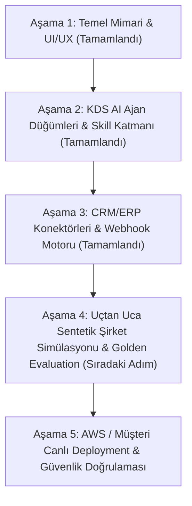

# Agentic Growth Operating System — Master Production Roadmap to Launch

* Last updated: 21 July 2026
* Goal: Complete commercial-grade B2B Agentic Growth Operating System MVP and prepare single-tenant customer deployment package.

---

## Roadmap Phases to Final Goal

---

## Phase Breakdown & Milestone Objectives

### Phase 1: Core Architecture & UI/UX (STATUS: COMPLETED ✓)
- LangGraph StateGraph, FastAPI, PostgreSQL checkpointer, ChromaDB RAG.
- B2B Enterprise Minimal React UI Console, Visual Workflow Editor (`@xyflow/react`), Real-Time Approval Center.

### Phase 2: KDS AI ABS Agent Nodes & Dynamic Skill Engine (STATUS: COMPLETED ✓)
- 7 specialized Pydantic AI agent contracts (`CompanyAnalysis`, `LeadOpportunity`, `CompetitorIntelligence`, `SecurityAudit`, `FinancialDiagnostics`, `SEOBrandIntelligence`, `CustomerSatisfaction`).
- Dynamic Skill (Capability) Management Engine (`capabilities.py`) with React UI Inspector binding.

### Phase 3: CRM/ERP Connectors, Webhooks & Onboarding Wizard (STATUS: COMPLETED ✓)
- Read-Only CRM (`ReadOnlyCRMConnector`) & ERP (`ReadOnlyERPConnector`) data layer.
- Immutable evidence locator generation (`ev_...`).
- 5-Step Interactive Onboarding Setup Wizard (`SetupWizard.tsx`) & Multi-Provider Model Gateway (Gemini API, Groq, Mistral, OpenRouter).
- Event-Driven Triggers & Webhook Ingestion Engine (`/api/webhooks/{source_id}`).

### Phase 4: End-to-End Synthetic Company Benchmark & Golden Evaluation (STATUS: CURRENT NEXT STEP 🎯)
- Build realistic synthetic B2B company dataset ("Anka Endüstriyel Otomasyon A.Ş.") with complete Accounts, Leads, Opportunities, Invoices, Competitor Signals, and OKF Knowledge bundle.
- Execute full E2E lifecycle: Webhook Event -> Workflow Trigger -> Agent Node Analysis -> Evidence Grounding -> Human Approval -> OKF Wiki Candidate Patch -> Active Bundle Promotion.
- Run Golden Evaluation suite (`scripts/run-golden-eval.py`) verifying claim verification and ChromaDB grounding coverage.

### Phase 5: AWS / Single-Tenant Customer Deployment & Security Boundary (STATUS: UPCOMING)
- Complete AWS deployment scripts (`infra/aws/`) and Docker Compose production configuration (`docker-compose.yml`).
- Negative security boundary tests and customer VPC isolation verification.
- Final Release Checklist verification (`docs/RELEASE_CHECKLIST.md`).
