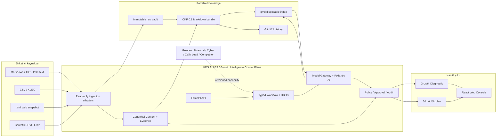
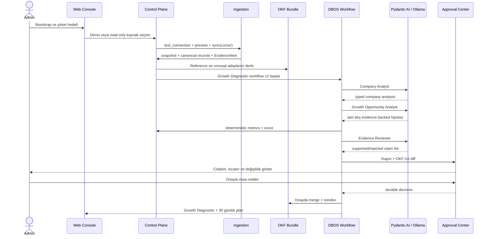
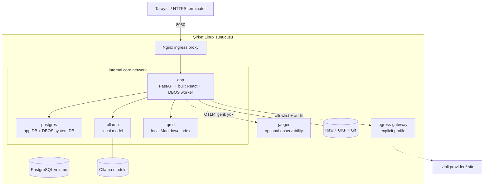
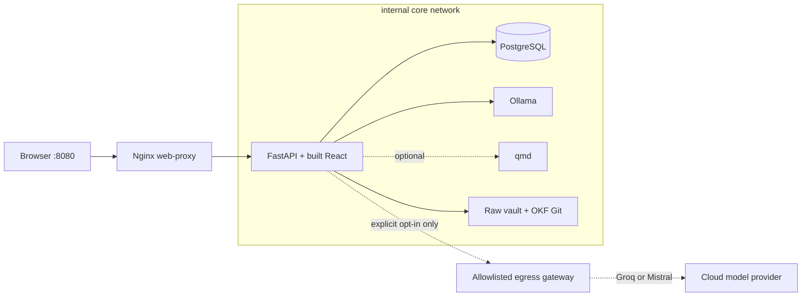
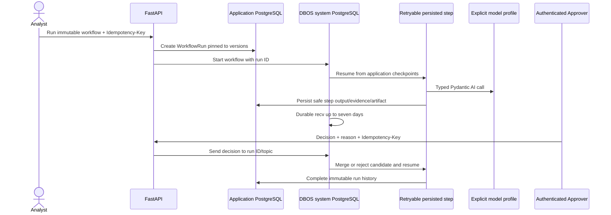
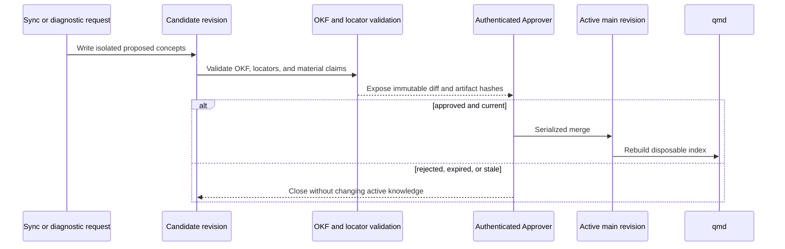

# Agentic Growth Intelligence — MVP Proje Mimarisi

**Durum:** Production-candidate uygulama mimarisi; model qualification bekliyor
**Hedef:** Tek şirket, self-hosted, local-first  
**Referans tarih:** 15 Temmuz 2026
**Format kararı:** Open Knowledge Format 0.1 (draft, adapter arkasında)

## 1. Amaç ve iş değeri

Sistem; şirket dokümanları, web snapshot'ları ve CRM/ERP benzeri yapılandırılmış dosyaları ortak bir kanıt modelinde birleştirir. Kurulum sonunda yöneticiye yalnızca sohbet ekranı değil, kaynak satırına kadar izlenebilen bir şirket özeti, ilk beş büyüme fırsatı ve 30 günlük plan verir.

MVP'nin başarı cümlesi şudur:

> Bir analist, şirket verisini dışarı çıkarmadan sisteme alabilmeli; sistem kanıta bağlı bir Growth Diagnostic üretmeli; insan onayı olmadan bilgi tabanını veya harici sistemi değiştirmemelidir.

## 2. Yüksek seviyeli tanım

`KDS AI ABS / Growth Intelligence Control Plane`, ingestion, OKF wiki, canonical context, agent çalıştırma, deterministic scoring, workflow ve approval bileşenlerini koordine eden kontrol düzlemidir. Kod içinde kısaltmanın açılımı varsayılmaz; `control_plane` ve `orchestrator` adları kullanılır.

İki farklı state sınıfı bilinçli olarak ayrılır:

- **Bilgi içeriği:** OKF 0.1 uyumlu Markdown/YAML; Git ile taşınabilir, okunabilir ve diff edilebilir.
- **Uygulama state'i:** kullanıcı, rol, workflow run, approval, audit, idempotency ve evidence locator için PostgreSQL.

Bu ayrımın ayrıntısı [ADR-0001](./adr/0001-okf-postgresql-boundary.md) içindedir.

## 3. Yönetici mimarisinin yorumu

| Yönetici kavramı | MVP karşılığı | Teknoloji | Not |
|---|---|---|---|
| KDS AI ABS | Growth Intelligence Control Plane | FastAPI, Pydantic AI, DBOS | Provider-neutral orchestration |
| Şirket dokümanları ve web sitesi | Knowledge Ingestion Layer | Python parser'lar, raw vault, Git | Snapshot ve hash zorunlu |
| Merkezi bilgi katmanı | OKF Knowledge Bundle + Context Graph | Markdown/YAML, qmd, PostgreSQL | qmd yalnız yeniden üretilebilir indeks |
| Model | Model Gateway | Ollama, Qwen 3.5 profilleri | Model adı domain koduna gömülmez |
| Şirketi Tanı | Company Analyst | Pydantic AI agent spec | Typed output |
| Potansiyel müşteriler | Mevcut account fırsat analizi | Sentetik CRM, deterministic metrics | Dış lead discovery değildir |
| Stratejik doküman | Growth Diagnostic | OKF Markdown + HTML | Citation ve evidence coverage içerir |
| CRM/ERP | Read-only adapter sözleşmeleri | CSV/XLSX, demo connector | İlk gerçek ürün partnerle seçilir |
| İnsan onayı | Approval Center | DBOS pause/resume, PostgreSQL, RBAC | Yedi günlük durable wait |
| Dashboard | Web Console | React, TypeScript, React Flow | Türkçe-first, i18n-ready |
| Workflow | Versioned Workflow Runtime | Typed DSL, DBOS | Published version immutable |
| Audit/güvenlik | Trust & Policy Layer | PostgreSQL audit, OpenTelemetry | Varsayılan no-egress |

## 4. MVP kapsam düzeltmeleri

Kaynak PRD ürün ailesi vizyonudur; tek geliştiricili ilk sürüm değildir. Aşağıdaki modüller mimaride extension point olarak görünür, fakat MVP'de aktif capability veya kullanıcı vaadi değildir:

- Financial Modules ve Cyber Security.
- Inbound/outbound call ve voice agent.
- Harici lead discovery/enrichment ve otomatik outreach.
- Rakip web araştırması, social, ads, AEO ve event intelligence.
- Canlı CRM/ERP vendor connector ve write-back.
- Multi-tenant SaaS, OIDC/SSO ve Kubernetes.

MVP, mevcut account'lar üzerinde büyüme fırsatı bulur. Yeni kişi toplamaz ve dış sisteme yazmaz.

## 5. Mantıksal mimari



## 6. Onboarding ve Growth Diagnostic akışı



## 7. Docker Compose deployment



Core profilde internet egress iş gereksinimi değildir. Container runtime seviyesinde kesin no-egress, hedef ortamın firewall politikasıyla tamamlanmalıdır.

## 8. Teknolojilerin kullanımı

| Teknoloji | Nerede | Neden | Nasıl sınırlandırılır |
|---|---|---|---|
| Python 3.12 | Backend | AI/veri ekosistemi, typed domain | `uv.lock`, Ruff, Pytest |
| FastAPI | API/control plane | Typed OpenAPI ve async I/O | `/api` boundary, RBAC dependency |
| Pydantic AI 2.x | Agent runtime | Typed result, toolset ve model abstraction | Agent'lar yalnız capability allowlist görür |
| DBOS | Durable workflow | PostgreSQL-backed restart/resume | Büyük içerik payload yerine artifact reference |
| PostgreSQL 16 | Operational state | ACID, audit ve workflow state | FK, unique idempotency key, hedefli index |
| OKF 0.1 | Portable knowledge | Vendor-neutral Markdown/YAML | Version-pinned adapter; strict producer/tolerant consumer |
| Git | Wiki change control | Diff, review, revert | Yalnız approved branch merge edilir |
| qmd | Local retrieval | BM25/vector/rerank, on-device | Kaynak gerçek değil; silinip yeniden üretilir |
| Ollama | Local model gateway | Şirket verisini yerelde tutar | Model profile ve golden eval |
| Qwen 3.5 9B/27B | Başlangıç model profilleri | Yerel structured-output adayı | Eval geçmezse profile yükseltilir |
| React + TypeScript + Vite | Web Console | Hızlı, typed ürün UI | Feature boundary, API schema types |
| React Flow | Kısıtlı workflow canvas | DAG editörü | Sabit node catalog; code/plugin/loop yok |
| OpenTelemetry/Jaeger v2.19 | Yerel gözlemlenebilirlik | HTTP latency ve status | Prompt/source body loglanmaz; opt-in profile |
| Docker Compose | Kurulum | Tek sunucu için anlaşılır operasyon | Pinned image, volume, healthcheck |

## 9. Bileşen sözleşmeleri

### ConnectorPort

```python
class ConnectorPort(Protocol):
    def test_connection(self) -> Health: ...
    def discover_schema(self) -> SourceSchema: ...
    def preview(self, limit: int = 50) -> list[RawRecord]: ...
    def sync(self, cursor: str | None) -> SyncResult: ...
    def health(self) -> Health: ...
```

MVP sözleşmesinde `create`, `update`, `send` veya `delete` yoktur.

### OKFBundlePort

Bundle create/read/write, unknown-field-preserving parse, index/log, link/backlink, conformance, AGI lint, diff, archive import/export işlemlerini kapsar. Domain modülleri YAML kütüphanesini doğrudan çağırmaz.

### ModelGateway

Agent sadece `model_profile_id` bilir. Gateway provider/model endpoint, sınıflandırma, egress, timeout ve structured-output politikasını çözer.
Kurulum UI'sı yalnız code-defined profil kataloğunu listeler; secret veya serbest provider URL/model
girişi kabul etmez. Seçilen profil gerçek probe'a gönderilir ve diagnostic başlamadan önce immutable
bir published workflow sürümündeki bütün agent node'larına pinlenir.

Local Qwen 3.5 profilleri typed extraction sırasında unpersisted reasoning'i kapatır ve Pydantic AI
PromptedOutput kullanır. Company Analyst v3 ve Growth Opportunity Analyst v3 bounded prompt/output
sözleşmeleri kullanır; opportunity contract aynı beş signal ID'yi tam birer kez ister. Evidence
Reviewer v3, claim'leri claim ve benzersiz evidence sayısına göre deterministik batch'lere böler;
her batch eksiksiz ve benzersiz claim kararları döndürmeden birleştirilemez. Ollama 8K context ve tek
paralel request ile çalışır. Agent sürümü run'a pinlenir; hiçbir daraltma model qualification veya
unsupported-claim kapısını gevşetmez.

Qualitative claim context'i en fazla üç immutable raw EvidenceItem excerpt'i ile sınırlandırılır.
Aggregate numerical claim ise birkaç temsilî satırla kanıtlanmış sayılmaz: hesaplama sürümü, metric
değerleri, factor/score, üye evidence sayısı ve tüm üye snapshot/excerpt hash/classification
değerlerinin digest'ini taşıyan
persisted bir `deterministic_metric` receipt'e bağlanır. Resolver receipt hash'ini ve üye zincirini
yeniden doğrular; model yalnız bounded receipt'i görür, tam üyelik PostgreSQL locator'ında korunur.

## 10. OKF bilgi mimarisi

```text
knowledge/
├── AGENTS.md                 Curator kuralları; bundle dışında
├── raw/<source-id>/          Immutable snapshot + manifest
└── bundles/company/
    ├── index.md              okf_version: "0.1"
    ├── log.md                newest-first ISO tarihli değişiklik günlüğü
    ├── organization/
    ├── products/
    ├── accounts/
    ├── opportunities/
    ├── metrics/
    ├── playbooks/
    ├── decisions/
    ├── reports/
    └── references/
```

Producer, her normal concept için en az `type`; kalite kapısı için `title`, `description`, `timestamp` ve `agi.sensitivity` üretir. Consumer bilinmeyen `type` ve frontmatter alanını kaybetmez. Broken link importu engellemez, warning oluşturur.

Reference concept ile PostgreSQL `EvidenceItem`, aynı `source_id` üzerinden bağlanır. Locator;
tabular kaynakta sheet/row/column, metinde section/line/hash içerir. Aggregate metric receipt locator'ı
ise calculation version, receipt hash ve tam raw EvidenceItem üyelik zincirini içerir; tek başına
model çıktısı kanıt değildir. qmd sonucu doğrudan model tool'u değildir; scope ve path kontrolü yapan
backend wrapper üzerinden geçer.

## 11. Agent, capability ve workflow modeli

MVP agent'ları: Wiki Curator, Company Analyst, Growth Opportunity Analyst, Evidence Reviewer. Agent'lar birbirini serbest çağırmaz. Workflow sıralamayı belirler.

Built-in Growth Diagnostic'te capability çağrıları workflow tarafından deterministik olarak
prefetch edilir. Model yalnız bounded sonuçları ve typed output sözleşmesini görür. Registry'deki
capability atamaları hangi verinin sunulabileceğini tanımlar; agent çalışma sırasında bu allowlist'i
genişletemez. Current published v3 analyzer/reviewer timeout ve output bütçeleri bounded ve
fail-closed'dur; bir profil release için ayrıca 20-run golden qualification geçmelidir.

`ManagedAgentSpec`; Pydantic AI Agent Spec'e model profile, prompt version, typed output, capability ID, timeout/token sınırı, veri sınıflandırması ve approval riski ekler.

İzinli capability seti:

- `knowledge.search`, `knowledge.read_source`, `context.query`
- `demo_crm.read`, `erp_file.read`, `metrics.calculate`
- `wiki.propose_update`, `report.publish`

Workflow DSL node'ları planla aynı sabit catalog'dan gelir. Publish öncesi: node allowlist, edge type, required config, tek trigger, erişilebilir output ve DAG kontrol edilir. Published sürüm immutable; run, workflow/agent/capability sürümlerine bağlanır.

## 12. Güvenlik ve approval

- Bir kerelik bootstrap token; ilk kullanıcı `Admin + Analyst + Approver` olabilir.
- Parolalar Argon2id; cookie HttpOnly, Secure, SameSite; state-changing isteklerde CSRF.
- Connector ve model secrets, env içine düz metin koymak yerine production Docker secret/master key ile şifrelenir.
- Doküman içeriği untrusted input'tur; instruction/data ayrımı ve tool allowlist uygulanır.
- MVP build'inde URL ingestion capability yoktur; gelecek URL connector allowlist, DNS rebinding,
  private IP, redirect ve boyut sınırlarını geçmeden eklenemez.
- HTML export escape edilir; formula benzeri tabular hücre uyarılır ve untrusted kalır. Gelecek CSV
  export formula escape etmelidir. Archive import traversal/symlink/expanded-size kontrolü yapar.
- Prompt, secret ve kaynak body audit/trace loguna yazılmaz.
- Approval yedi gün bekleyebilir; idempotent decision ve restart sonrası resume zorunludur.
- Harici write capability MVP build'inde bulunmaz; yalnız UI policy değil, interface seviyesinde yoktur.

## 13. MVP ve sonraki fazlar

**MVP:** setup wizard, sentetik/read-only ingest, OKF bundle, knowledge explorer, dört agent, deterministic diagnostic, evidence review, dashboard, constrained workflow, approval, export ve backup/restore.

**İlk tasarım ortağından sonra:** gerçek CRM/ERP read-only connector, OIDC, taranmış doküman/OCR, kontrollü write action ve consent/legal tasarımı.

**Ürün vizyonu:** financial/cyber/call, lead/competitor, campaign/social/AEO/event modülleri. Her biri yeni capability, threat model, eval ve approval sınıfı gerektirir.

## 14. Riskler, varsayımlar ve açık sorular

| Risk | Etki | Azaltma |
|---|---|---|
| OKF 0.1 draft değişir | Bundle uyumsuzluğu | Adapter + pinned version + round-trip fixture |
| 9B structured output zayıf | Hatalı/kararsız rapor | Golden eval; 27B profile; deterministic calculation |
| Sentetik veri gerçek karmaşıklığı saklar | Pilot sürprizi | İlk partnerde source discovery sprint |
| qmd/GPU kaynak tüketimi | Kurulum başarısızlığı | Lexical fallback; optional hybrid profile |
| LLM desteklenmeyen iddia üretir | Güven kaybı | Evidence Reviewer + material claim gate |
| Self-hosted operasyon yükü | Upgrade/backup sorunu | Compose, healthcheck, versioned migrations, restore drill |

Açık sorular: ilk tasarım ortağının CRM/ERP'si; kurumun veri sınıfları; kabul edilen model donanımı; retention süresi; approval sahipliği; dış web snapshot için yasal/teknik allowlist.

## 15. Mimari kabul kriterleri

1. Temiz Compose kurulumunda web/API/PostgreSQL açılır ve demo seçilebilir.
2. Ham kaynak → Reference → EvidenceItem → claim zinciri UI'da çözülebilir.
3. OKF export/import unknown metadata'yı korur; broken link warning'dir.
4. Diagnostic, planted altı içgörünün en az beşini bulur ve sayısal iddia uydurmaz.
5. Invalid workflow publish edilmez; duplicate run oluşmaz; approval restart sonrası sürer.
6. Cloud/egress varsayılan kapalı ve connector API'si read-only'dir.
7. Yönetici ekranı gelecek modülleri MVP'de varmış gibi göstermez.

## 16. Audited implementation boundary — 14 July 2026

This section distinguishes the deployed scaffold from the target architecture. `docs/IMPLEMENTATION_STATUS.md` is authoritative for capability status.



Only Nginx publishes a host port. Standard Compose enforces bootstrap/session authentication, roles,
CSRF, migrations, and material-operation audit. Source, mapping, snapshot, canonical context, evidence,
artifact, OKF candidate, agent/workflow versions, schedules, runs, steps, approvals, and setup progress
are persistent. Diagnostic scores are deterministic from persisted data; narrative analysis is produced
by four typed Pydantic AI calls and every material claim must pass the Evidence Reviewer gate.
Workflow authoring/publication, DBOS durable execution, approval pause/resume, and the corresponding
web surfaces are implemented. Release acceptance still requires a qualified real model, external Linux
host rehearsal, and repetition of the qmd rebuild drill on that release host.

`POST /api/diagnostics/run` is only a compatibility start view. It resolves an existing immutable
published workflow version and delegates to the same DBOS runtime as the workflow API; it never invokes
the legacy synchronous diagnostic service. Setup and Dashboard prepare/reuse a profile-pinned published
`growth-diagnostic` version, start it through this view, and poll the persisted run until its
evidence-reviewed diagnostic is awaiting approval or completed. Durable cancellation must succeed in
DBOS before application state is marked cancelled.

### Implemented workflow persistence path



### Implemented OKF storage lifecycle



PostgreSQL owns candidate metadata, expiry, artifacts, and audit state. Git worktrees own isolated candidates and `main` owns approved portable knowledge history. A filesystem merge lock serializes fast-forward approval; rejected, expired, and stale candidates do not change active knowledge. qmd is requested to reindex only after approval and lexical search remains available when qmd is absent. The implemented model-backed Evidence Reviewer rejects unsupported material or numerical claims before a candidate is presented.

### Cloud production policy

Cloud profiles are permitted only through explicit administrator configuration and the allowlisted egress gateway. There is no local-to-cloud automatic fallback. `public` and policy-approved redacted `internal` content may be processed; `confidential` and `restricted` content is rejected before a cloud request. Every run pins provider/model identity and records content-safe audit metadata.

### Release workflow and qualification automation

The immutable built-in Growth Diagnostic workflow uses the reserved ID
`builtin-growth-diagnostic` and version 2. User clones must use a non-reserved ID. It executes Company Analyst,
Growth Opportunity Analyst, Evidence Reviewer, and Wiki Curator before report creation and durable
approval. Dashboard compatibility reads the reserved built-in ID plus legacy/user
`growth-diagnostic` IDs; therefore the browser displays the same persisted DBOS output that Approval
Center governs.

Release qualification is automated but remains opt-in and destructive. The real-model Playwright
suite targets an explicitly supplied authenticated deployment, verifies all four pinned agent steps,
exact evidence, durable approval, active OKF merge, and export. During the Linux x86-64 rehearsal a
host-side watchdog restarts the exact app container once while a real agent step is running and once
while the same run waits for approval. The browser waits for the second healthy checkpoint and the
watchdog rejects a changed run/container ID. The rehearsal composes no-egress, scan, independently
validated 20-run qualification, browser acceptance, restart/resume, backup/restore, lexical fallback,
qmd rebuild, and a SHA-256-bound content-safe manifest. Automation availability is not evidence that
the external-host gate passed.
