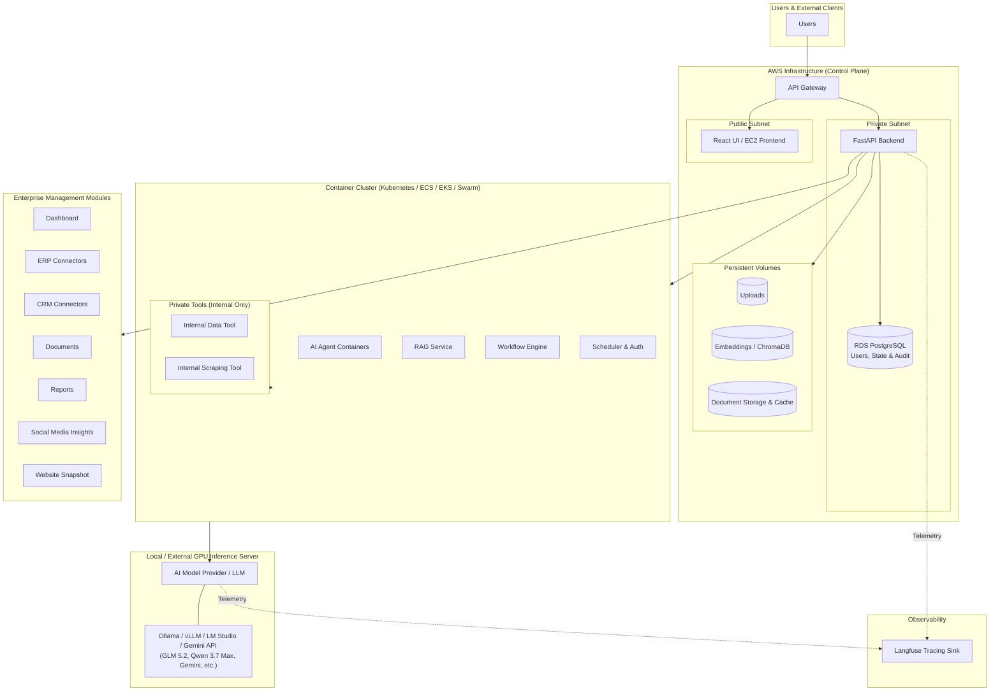
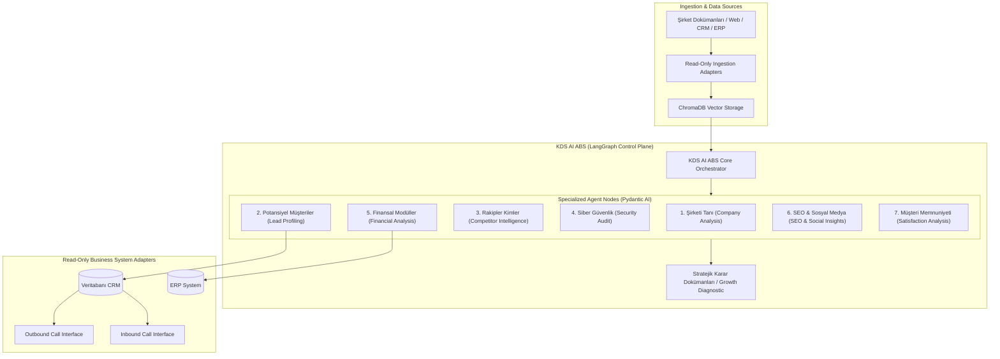
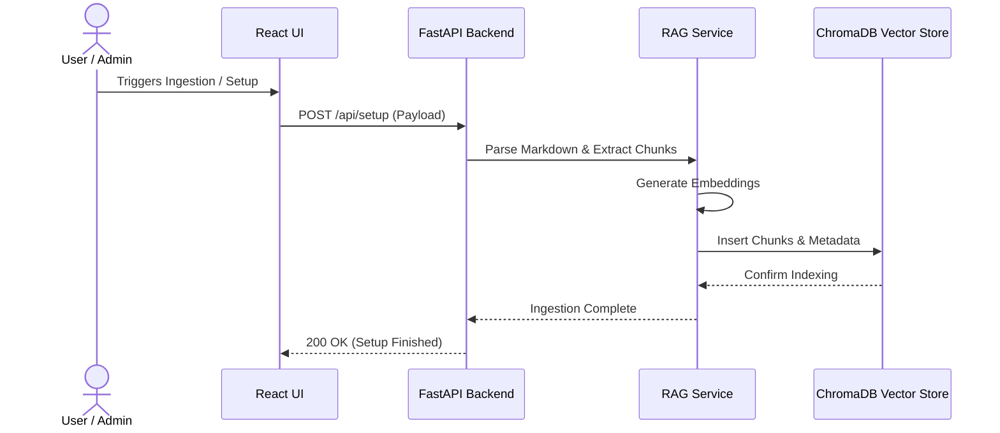
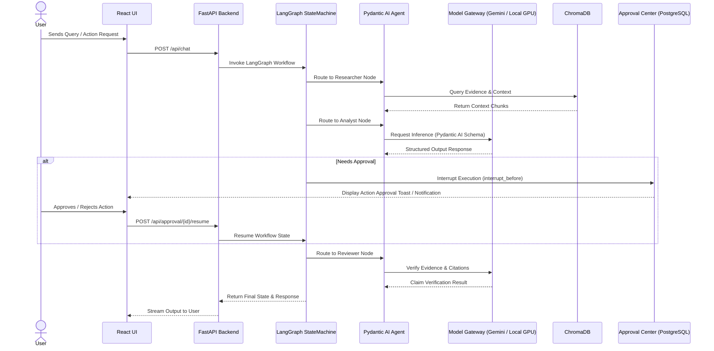

# System Architecture

This document is the **authoritative single source of truth** for the overarching architecture of the **Agentic Growth Intelligence (AGI)** platform. It integrates the infrastructure boundaries, agentic business workflows, and technical stack.

---

## 1. Core Technology Stack

- **Backend API**: FastAPI (Python 3.12)
- **Agent Orchestration**: LangGraph (StateGraph state machines, checkpointing, human-in-the-loop approvals)
- **Agent Runtime & Structured Outputs**: Pydantic AI
- **Model Gateway (LLM Provider Abstraction)**: Provider-neutral gateway supporting Gemini API (Cloud) and Local/External GPU Inference Servers (Ubuntu Server GPU running Ollama, vLLM, LM Studio with models like GLM 5.2, Qwen 3.7 Max, etc.)
- **Vector Store / RAG**: ChromaDB (disposable vector embeddings derived from OKF 0.1 Markdown sources)
- **Operational Database**: PostgreSQL (users, roles, source locators, LangGraph state checkpoints, audit logs)
- **Frontend**: React UI (Vite, TypeScript, Tailwind CSS, Enterprise Minimal theme, `@xyflow/react` Visual Node Editor)
- **Observability & Tracing**: Self-hosted Langfuse telemetry tracing across LLMs, tools, and VPC boundaries

---

## 2. Infrastructure Architecture

The platform combines cloud control plane management (AWS) with containerized tool clusters, isolated local/cloud GPU model inference, and enterprise management modules.

---

## 3. Agentic Business System (KDS AI ABS) Workflow Architecture

The core intelligent processing is driven by the **KDS AI ABS** (Agentic Business System) orchestrator inside LangGraph. It processes untrusted business documents and data sources through specialized agent nodes to produce evidence-backed growth diagnostics.

### Agent Node Breakdown:
1. **Şirketi Tanı (Company Profiling)**: Analyzes internal documents, company history, and core capabilities.
2. **Potansiyel Müşteriler (Account Growth)**: Profiles potential growth leads and existing account expansion opportunities.
3. **Rakipler Kimler (Competitor Intelligence)**: Analyzes competitor locations, strategies, customer feedback, and weaknesses via authorized web scraping.
4. **Siber Güvenlik (Cybersecurity Audit)**: Assesses digital footprint security stance and vulnerability risks.
5. **Finansal Modüller (Financial Diagnostics)**: Performs deterministic financial ratio analysis and growth calculations.
6. **SEO & Sosyal Medya**: Analyzes search engine visibility, brand presence, and social media sentiment.
7. **Müşteri Memnuniyeti**: Evaluates customer feedback, support interaction data, and satisfaction metrics.

---

## 4. End-to-End Execution Sequence

### A. Data Ingestion Sequence

### B. Agent Chat & Human-in-the-Loop Approval Sequence

---

## 5. Security & Boundary Principles

1. **Read-Only External Interactions (MVP)**: The platform performs read-only data ingestion and authorized web scraping. Autonomous external writes or messaging actions are prohibited without explicit human approval.
2. **Direct DB Isolation**: AI agent containers and model servers **never** connect directly to the database. All interactions must go through authorized FastAPI endpoints.
3. **Data Privacy Rules**: Confidential or restricted internal content is sanitized prior to sending to public cloud LLM endpoints.
4. **Self-Hosted Observability**: Telemetry (prompts, responses, latent traces) is routed strictly to the self-hosted Langfuse instance.
