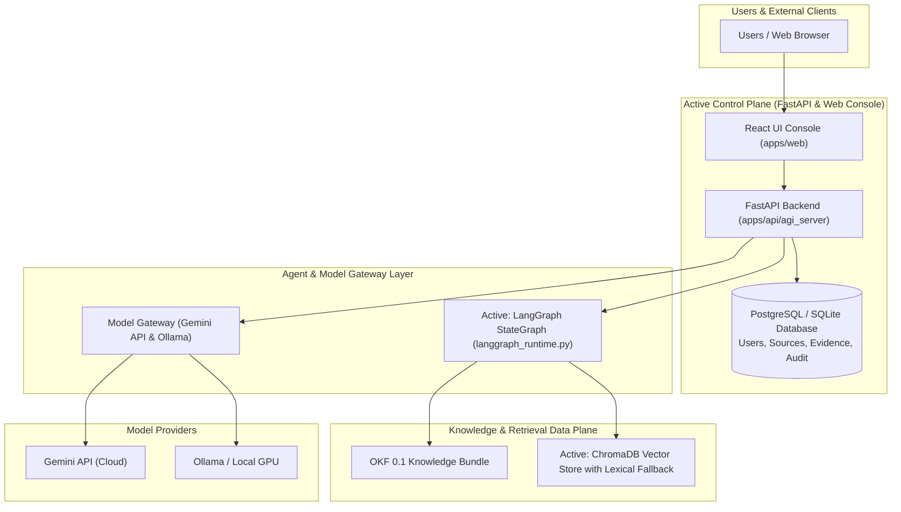
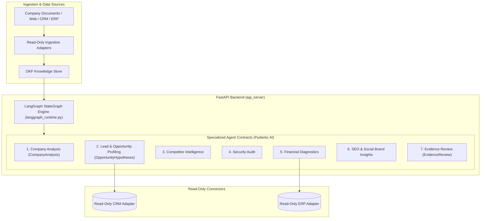

# System Architecture

This document is the **authoritative single source of truth** for the overarching architecture of the **Agentic Growth Intelligence (AGI)** platform. It describes both the **Target Unified Architecture** and the **Current Implementation Baseline** along with the migration roadmap (ADR-0016).

---

## 1. Core Technology Stack

### Target & Active Unified Architecture (ADR-0016)
- **Backend API**: FastAPI (`apps/api/agi_server`, Python 3.12)
- **Agent Orchestration**: LangGraph (StateGraph execution engine in `langgraph_runtime.py` with pause/resume approval semantics)
- **Agent Runtime & Structured Outputs**: Pydantic AI contracts and probes (`agi_server/agents/probe.py`)
- **Model Gateway**: Provider-neutral gateway supporting Gemini API (Cloud) and Local/External GPU Inference Servers (Ollama, vLLM, LM Studio)
- **Vector Store / RAG**: ChromaDB / QMD vector search with automatic lexical fallback (`okf/search.py`)
- **Connector Protocol**: Approved product-owned MCP Client Gateway (`mcp.py`) with code-defined allowlists
- **Operational Database**: PostgreSQL / SQLite via SQLAlchemy (`agi_server/db.py`)
- **Frontend Console**: React UI (`apps/web` - Vite, TypeScript, Vanilla CSS, `@xyflow/react` Visual Node Editor)
- **Observability**: Self-hosted Langfuse telemetry tracing sink boundary

---

## 2. Infrastructure Architecture

The platform combines a cloud control plane (AWS / Docker) with containerized application services, isolated local/cloud GPU model inference, and enterprise management modules.

---

## 3. Agentic Business System (KDS AI ABS) Workflow Architecture

The core intelligent processing is designed around specialized agent nodes that analyze untrusted business documents and data sources to produce evidence-backed growth diagnostics.

---

## 4. Execution & Alignment Status

### Current vs Target Feature Comparison

| Domain | Current Active State (`agi_server`) | Target Architecture (ADR-0016) | Status / Roadmap |
|---|---|---|---|
| **Orchestrator** | LangGraph `StateGraph` active with MemorySaver checkpointer (`langgraph_runtime.py`) | Native LangGraph engine (PostgreSQL checkpointer in subsequent phase) | Phase 2-3 Active |
| **Agent Nodes** | Pydantic AI probes & contracts | Native Pydantic AI LangGraph nodes | Active Baseline |
| **Vector Store** | ChromaDB vector search with automatic lexical fallback (`okf/search.py`) | Integrated ChromaDB Vector Database | Phase 6 Completed |
| **MCP Connectors** | Product-owned read-only MCP Client Gateway (`mcp.py`) | Standardized MCP Gateway | Phase 7 Completed |
| **UI Surface** | React UI (`apps/web` with Vanilla CSS) | Single React UI Console (`apps/web`) | Active Baseline |
| **Legacy Artifacts** | `apps/services/ai-agent`, `apps/services/rag`, `apps/frontend/*` | Deprecated / Scheduled for Pruning | Legacy (Phase 5) |

---

## 5. Security & Boundary Principles

1. **Read-Only External Interactions (MVP)**: The platform performs read-only data ingestion and authorized web scraping. Autonomous external writes or messaging actions are prohibited without explicit human approval.
2. **Direct DB Isolation**: AI agent tasks and model providers **never** connect directly to the database. All interactions are routed through authorized FastAPI endpoints.
3. **Data Privacy Rules**: Confidential or restricted internal content is sanitized prior to sending to public cloud LLM endpoints.
4. **Self-Hosted Observability**: Telemetry (prompts, responses, latent traces) is strictly configured for self-hosted sinks without external SaaS data egress.
